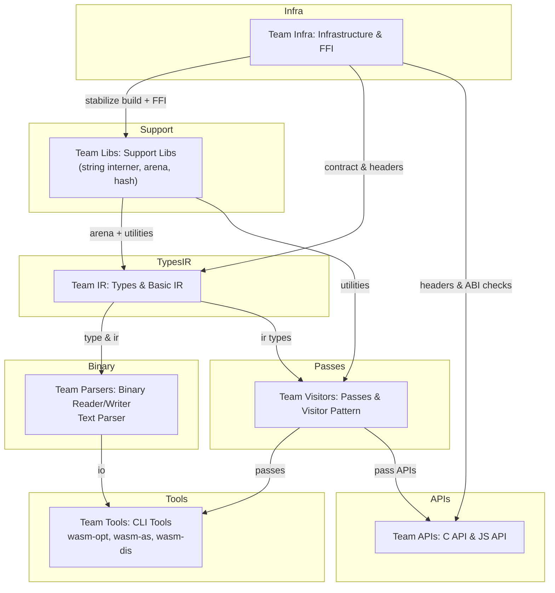
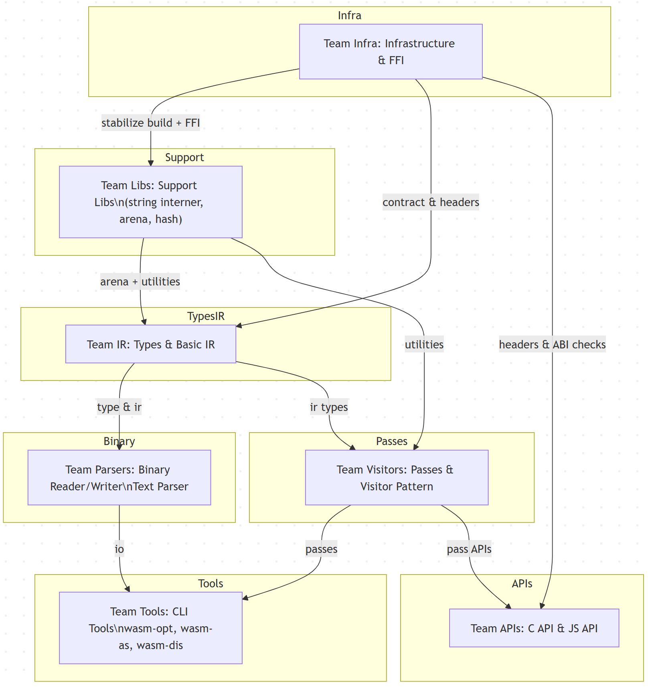

# Task List by Team — Binaryen Rust Conversion

This document sets out the tasks for each team and maps dependencies, using the plan stored in `docs/rust/vision`.

- Vision documents:
  - [RUST_CONVERSION_PLAN.md](../vision/RUST_CONVERSION_PLAN.md) — master plan and phased breakdown
  - [RUST_CONVERSION_SUMMARY.md](../vision/RUST_CONVERSION_SUMMARY.md) — quick summary
  - [rust-conversion-checklists.md](../vision/rust-conversion-checklists.md) — detailed checklists
  - [rust-conversion-getting-started.md](../vision/rust-conversion-getting-started.md) — dev guide and example
  - [rust-conversion-technical-specs.md](../vision/rust-conversion-technical-specs.md) — FFI patterns & arena

> NOTE: These links point to the `docs/rust/vision` folder. Use the checklists for exit criteria and testing guidelines.

---

## Team Infra — Infrastructure & FFI (owner)
Primary goal: Make Rust buildable and linkable from the main CMake/Ninja pipeline. Provide `cbindgen` and CI checks.

Key tasks:
- [ ] Implement `rust/` workspace & skeleton crates (see [Getting Started](../vision/rust-conversion-getting-started.md)).
- [ ] Add CMake module `cmake/BinaryenRust.cmake` to invoke Cargo as documented in the plan ([Phase 0](../vision/RUST_CONVERSION_PLAN.md#phase-0-infrastructure-setup)).
- [ ] Add `BUILD_RUST_COMPONENTS` flag and ensure toggled behavior works in CI ([Checklists](../vision/rust-conversion-checklists.md#phase-0-infrastructure-setup)).
- [ ] Set up `cbindgen` configuration and a golden header test (see [FFI Patterns](../vision/rust-conversion-technical-specs.md#ffi-patterns)).
- [ ] Add CI jobs:
  - `cargo test --all`
  - `cbindgen` golden header test
  - `cmake`+`cargo` integration job (`BUILD_RUST_COMPONENTS=ON`) — see [Testing Strategy](../vision/RUST_CONVERSION_PLAN.md#testing-strategy)

Exit criteria:
- `BUILD_RUST_COMPONENTS` can be enabled without breaking baseline builds
- `cbindgen` golden validation in CI

---

## Team Libs — Support Libs & Utilities (owner)
Primary goal: Convert small, leaf components (string interner, arena allocators, small hash maps) that many other teams will rely on.

Key tasks:
- [ ] Create `rust/binaryen-support` in Cargo workspace (see [Getting Started](../vision/rust-conversion-getting-started.md#first-component-string-interning)).
  - [x] Implement `StringInterner` with tests and FFI wrapper in `binaryen-ffi`.
  - [x] Implement arena (`bumpalo` style) and basic containers (`ahash`) for IR.
  - [x] Add benchmarks (`criterion`) and property tests (`proptest`).
  - [x] Add `cargo-fuzz` harnesses for fuzzing interner/arena/ahash (manual `workflow_dispatch` + `scripts/run_cargo_fuzz.sh`).
- [ ] Add CI `cargo test` and `miri` checks.

Dependencies:
- Team Infra for CI/cargo integration

Exit criteria:
- Unit tests pass and `cargo test` in CI is stable
- Performance is within thresholds described in [Plan Phase 1](../vision/RUST_CONVERSION_PLAN.md#phase-1-utility-components)

---

## Team IR — Types & Basic IR (owner)
Primary goal: Implement core `Type` enum, `Signature`, `HeapType`, and initial IR expr nodes used across the codebase.

Key tasks:
- [ ] Implement `rust/binaryen-core` with `Type` and `Signature` (see [Plan Phase 2](../vision/RUST_CONVERSION_PLAN.md#phase-2-type-system)).
- [ ] Implement Type printing & ordering utilities
- [ ] Build minimal IR `Expression` enum and small set of nodes (`Const`, `LocalGet`, `Block`) (see [Phase 3 IR core](../vision/RUST_CONVERSION_PLAN.md#phase-3-ir-core)).
- [ ] Stabilize Arena API with Team Libs — freeze memory layout and ownership policies ([Technical Specs](../vision/rust-conversion-technical-specs.md#memory-management)).
- [ ] Add `#[repr(C)]` for any types used across FFI and update `cbindgen` config.

Dependencies:
- Team Infra and Team Libs for FFI and arena

Exit criteria:
- Tests for type equality & serialization pass
- `Arena` is agreed/locked and used by IR nodes

---

## Team Parsers — Binary Reader/Writer & Text Parser (owner)
Primary goal: Implement `WasmBinaryReader`, `WasmBinaryWriter`, and the WAT parser/printer.

Key tasks:
- [ ] Implement `binaryen-binary` crate readers and writers ([Plan Phase 4](../vision/RUST_CONVERSION_PLAN.md#phase-4-binary-format)).
- [ ] Add round-trip tests with spec-based test files
- [ ] Add fuzzing harness to `cargo fuzz` for malformed input tests
- [ ] Integrate `WAT` parser/printer work with `src/parser/` tests

Dependencies:
- Team IR's `Type` for parsing type sections

Exit criteria:
- Round-trip read/write tests pass
- Fuzzer catches no low-level undefined behavior

---

## Team Visitors — Passes & Visitor Pattern (owner)
Primary goal: Provide pass infrastructure and convert individual optimization passes.

Key tasks:
- [ ] Implement `Pass` trait and `PassRunner` in `binaryen-passes` crate ([Plan Phase 5](../vision/RUST_CONVERSION_PLAN.md#phase-5-optimization-passes)).
- [ ] Implement visitor/walker patterns (see [TRAVERSAL](../vision/RUST_CONVERSION_PLAN.md#visitor-pattern)).
- [ ] Convert simple passes (Vacuum, DeadCodeElimination, Precompute) first, each in independent PRs.
- [ ] Add unit tests comparing C++ vs Rust outputs for each pass (see [Checklists Phase 5](../vision/rust-conversion-checklists.md#phase-5-optimization-passes)).

Dependencies:
- Team Libs, Team IR for support & IR

Exit criteria:
- Passes produce equivalent output to C++ for unit tests
- PassRunner/API is stable

---

## Team Tools — CLI Tools (owner)
Primary goal: Convert CLI tools (wasm-as, wasm-dis, wasm-opt) to call into Rust crates.

Key tasks:
- [ ] Implement CLI skeletons using `clap` as described ([Phase 6 Tools](../vision/RUST_CONVERSION_PLAN.md#phase-6-tools)).
- [ ] Convert smaller tools (`wasm-as`, `wasm-dis`) first
- [ ] Add CLI test harnesses to validate outputs vs C++

Dependencies:
- Team Parsers for binary + text parsing
- Team Visitors for passes

Exit criteria:
- CLI outputs match C++ tools for critical tests
- CLI options are backward-compatible

---

## Team APIs — C API & JS API (owner)
Primary goal: Provide compatibility through the C API (`binaryen-c-api`) and JS bindings (`wasm-bindgen`).

Key tasks:
- [ ] Expose FFI-safe wrappers for key modules in `binaryen-ffi` (see [FFI Specs](../vision/rust-conversion-technical-specs.md#ffi-patterns)).
- [ ] Add `cbindgen`+`golden` checks in CI
- [ ] Implement `wasm-bindgen` wrappers and test with `node` test suites
- [ ] Verify interoperability with external consumers (Emscripten, wasm-pack)

Dependencies:
- Team Infra (FFI & cbindgen)
- Team IR (Types) and Team Visitors (Passes) for wiring

Exit criteria:
- C API is ABI compatible with prior version
- JS API tests pass

---

## Cross-team integration tests
- Add CI gating jobs to run the `BUILD_RUST_COMPONENTS=ON` build and call `./check.py --rust` (see [Testing Strategy](../vision/RUST_CONVERSION_PLAN.md#testing-strategy)).
- Add nightly performance and `miri` checks (see [Plan & Specs](../vision/RUST_CONVERSION_PLAN.md#validation-criteria)).

---

## Team diagram

Below is an integrated diagram that maps tasks and dependencies.

---

## Recommended CI/gating and policy
- Use `BUILD_RUST_COMPONENTS` default OFF and gated in CI builds for Rust integration until each phase is verified.
- Add `cbindgen` golden checks for FFI header stability and a nightly job for performance regressions.
- Require small PRs per pass or crate; enforce code-review signoffs for FFI and `#[repr(C)]` changes.

---

## How to use this doc
- Assign one or more owners per team and add weekly updates to this file.
- Use `rust-conversion-checklists.md` for tests & exit criteria. Link to any PRs that implement these items.

---

*Generated by plan; update this document as the conversion progresses.*
