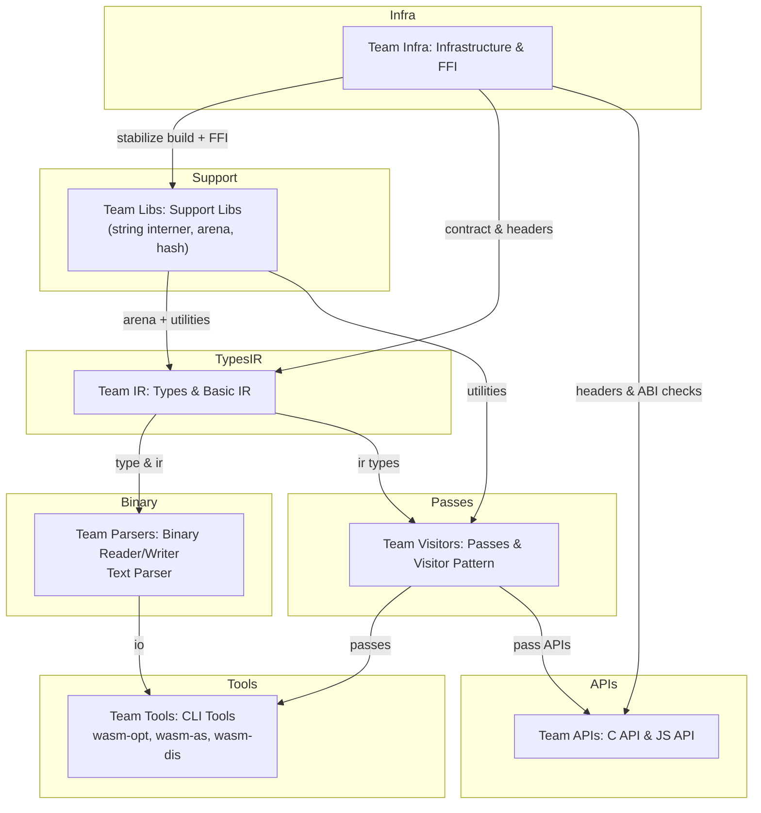

# Task List by Team — Binaryen Rust Conversion

This document sets out the tasks for each team and maps dependencies, using the plan stored in `docs/rust/vision`.

- Vision documents:
  - [RUST_CONVERSION_PLAN.md](../vision/RUST_CONVERSION_PLAN.md) — master plan and phased breakdown
  - [RUST_CONVERSION_SUMMARY.md](../vision/RUST_CONVERSION_SUMMARY.md) — quick summary
  - [rust-conversion-checklists.md](../vision/rust-conversion-checklists.md) — detailed checklists
  - [rust-conversion-getting-started.md](../vision/rust-conversion-getting-started.md) — dev guide and example
  - [rust-conversion-technical-specs.md](../vision/rust-conversion-technical-specs.md) — FFI patterns & arena

> NOTE: These links point to the `docs/rust/vision` folder. Use the checklists for exit criteria and testing guidelines.

---

## Team Infra — Infrastructure & FFI (owner)
Primary goal: Make Rust buildable and linkable from the main CMake/Ninja pipeline. Provide `cbindgen` and CI checks.
- [x] Add `BUILD_RUST_COMPONENTS` flag and ensure toggled behavior works in CI ([Checklists](../vision/rust-conversion-checklists.md#phase-0-infrastructure-setup)).
- [x] Set up `cbindgen` configuration and a golden header test (see [FFI Patterns](../vision/rust-conversion-technical-specs.md#ffi-patterns)).
  - `cbindgen` golden header test (CI: `.github/workflows/rust-ci.yml`)
  - `cmake`+`cargo` integration job (`BUILD_RUST_COMPONENTS=ON`) — CI validates linkage using `ctest -R rust_ffi_smoke -V`
- [x] `BUILD_RUST_COMPONENTS` can be enabled without breaking baseline builds

---
Primary goal: Convert small, leaf components (string interner, arena allocators, small hash maps) that many other teams will rely on.
Key tasks:
- [x] Create `rust/binaryen-support` in Cargo workspace (see [Getting Started](../vision/rust-conversion-getting-started.md#first-component-string-interning)).
  - [x] Implement `StringInterner` with tests and FFI wrapper in `binaryen-ffi`.
  - [x] Implement arena (`bumpalo` style) and basic containers (`ahash`) for IR.
  - [x] Add benchmarks (`criterion`) and property tests (`proptest`).
  - [x] Add `cargo-fuzz` harnesses for fuzzing interner/arena/ahash (manual `workflow_dispatch` + `rust/scripts/run_cargo_fuzz.sh`).
- [x] Add CI `cargo test` (done) and `miri` checks (present for many crates; scope to increase)

Dependencies:
- Team Infra for CI/cargo integration

Exit criteria:
- Unit tests pass and `cargo test` in CI is stable
- Performance is within thresholds described in [Plan Phase 1](../vision/RUST_CONVERSION_PLAN.md#phase-1-utility-components)

---

## Team IR — Types & Basic IR (owner)
Primary goal: Implement core `Type` enum, `Signature`, `HeapType`, and initial IR expr nodes used across the codebase.

Key tasks:
- [x] Implement `rust/binaryen-core` with a `Type` enum (basic and common reference types implemented).
- [x] Implement `Signature` and `HeapType` (basic implementations present).
- [ ] Implement `TypeStore` (interning) and API for interned `Signature` and `HeapType` (`rust/binaryen-core/src/type_store.rs`).
- [ ] Add constructors that intern types (e.g., `Signature::intern(params, results) -> Type`).
- [ ] Implement Type printing & ordering utilities (`Display`/`Debug`, canonicalization helpers).
- [ ] Add `#[repr(C)]`-safe FFI wrappers for Types in `binaryen-ffi` and update `cbindgen` config (`rust/binaryen-ffi/src/type_ffi.rs`).
- [ ] Add unit tests & `proptest` for Type interning, serialization, and ordering.
- [ ] Add a C++ round-trip smoke test in `test/rust_consumer/test_ffi_type_roundtrip.cpp` that creates types in Rust and verifies them in C++.
- [ ] Build minimal IR `Expression` enum and small set of nodes (`Const`, `LocalGet`, `Block`) only after TypeStore is stabilized (see [Phase 3 IR core](../vision/RUST_CONVERSION_PLAN.md#phase-3-ir-core)).
- [ ] Stabilize Arena API with Team Libs — freeze memory layout and ownership policies ([Technical Specs](../vision/rust-conversion-technical-specs.md#memory-management)).

Dependencies:
- Team Infra and Team Libs for FFI and arena

Exit criteria:
- `TypeStore` implemented and tested (interning works and is deterministic)
- FFI wrappers for types are present and included in the `cbindgen` golden header
- Cross-language tests pass validating type creation and round-trip
- `Arena` and lifetime model agreed for IR nodes and used by initial IR tests

---

## Team Parsers — Binary Reader/Writer & Text Parser (owner)
Primary goal: Implement `WasmBinaryReader`, `WasmBinaryWriter`, and the WAT parser/printer.

Key tasks:
- [ ] Implement `binaryen-binary` crate readers and writers ([Plan Phase 4](../vision/RUST_CONVERSION_PLAN.md#phase-4-binary-format)).
- [ ] Add round-trip tests with spec-based test files
- [ ] Add fuzzing harness to `cargo fuzz` for malformed input tests
- [ ] Integrate `WAT` parser/printer work with `src/parser/` tests

Dependencies:
- Team IR's `Type` for parsing type sections

Exit criteria:
- Fuzzer catches no low-level undefined behavior

## Team Visitors — Passes & Visitor Pattern (owner)
Primary goal: Provide pass infrastructure and convert individual optimization passes.
- [ ] Implement visitor/walker patterns (see [TRAVERSAL](../vision/RUST_CONVERSION_PLAN.md#visitor-pattern)).
- [ ] Convert simple passes (Vacuum, DeadCodeElimination, Precompute) first, each in independent PRs.
- [ ] Add unit tests comparing C++ vs Rust outputs for each pass (see [Checklists Phase 5](../vision/rust-conversion-checklists.md#phase-5-optimization-passes)).

Dependencies:
- Team Libs, Team IR for support & IR

Exit criteria:
- PassRunner/API is stable
## Team Tools — CLI Tools (owner)

Key tasks:
- [ ] Add CLI test harnesses to validate outputs vs C++
Dependencies:
- Team Parsers for binary + text parsing
 [x] Make `rust/scripts` canonical by removing any remaining `scripts/` duplicates and ensure the PR template asks for the required checks to be run.

Exit criteria:
- CLI outputs match C++ tools for critical tests
- CLI options are backward-compatible

---

## Team APIs — C API & JS API (owner)
Primary goal: Provide compatibility through the C API (`binaryen-c-api`) and JS bindings (`wasm-bindgen`).

Key tasks:
- [x] Expose FFI-safe wrappers for key modules in `binaryen-ffi` (string interner, arena, ahash helpers).
- [x] Add `cbindgen`+`golden` checks in CI (helper `rust/scripts/update_cbindgen.sh` present)
- [ ] Implement `wasm-bindgen` wrappers and test with `node` test suites
- [ ] Verify interoperability with external consumers (Emscripten, wasm-pack)

Dependencies:
- Team Infra (FFI & cbindgen)
- Team IR (Types) and Team Visitors (Passes) for wiring

Exit criteria:
- C API is ABI compatible with prior version
- JS API tests pass

---

## Cross-team integration tests
- [x] Add CI gating jobs to run the `BUILD_RUST_COMPONENTS=ON` build and call `./check.py --rust` (see [Testing Strategy](../vision/RUST_CONVERSION_PLAN.md#testing-strategy)); CI also runs `ctest -R rust_ffi_smoke -V` to verify C++/Rust linkage.
- [x] Add nightly performance and `miri` checks (see [Plan & Specs](../vision/RUST_CONVERSION_PLAN.md#validation-criteria)); a bench job skeleton and miri steps exist in CI and should be expanded for coverage.
 - [x] Add nightly performance and `miri` checks (see [Plan & Specs](../vision/RUST_CONVERSION_PLAN.md#validation-criteria)); a nightly bench job uploads artifacts and Miri now runs nightly; comparator & sanitizer expansion remain pending.
 - [x] Add CI gating jobs to run the `BUILD_RUST_COMPONENTS=ON` build and call `./check.py --rust` (see [Testing Strategy](../vision/RUST_CONVERSION_PLAN.md#testing-strategy)); CI also runs `ctest -R rust_ffi_smoke -V` to verify C++/Rust linkage.
 - [x] Add nightly performance and `miri` checks (see [Plan & Specs](../vision/RUST_CONVERSION_PLAN.md#validation-criteria)); a bench job skeleton exists as CI and uploads Criterion artifacts for nightly runs; Miri now runs nightly for support and core crates.

---

## Team diagram

Below is an integrated diagram that maps tasks and dependencies.

---

## Recommended CI/gating and policy
---

### Summary (current state)

- **Phase 0 (Infra & FFI)**: Implemented and validated — Cargo workspace, `cmake/BinaryenRust.cmake`,`cbindgen` golden header, CI jobs (`rust-ci`, `cmake` integration), `rust/scripts`, and smoke consumer testing exist.
- **Phase 1 (Support libs)**: Implemented — `StringInterner`, `Arena`, `ahash` helpers, benches, property tests, and fuzz harnesses. FFI wrappers for these helpers are present.
- **Phase 2 (Types & IR)**: In progress — basic `Type` enum implemented; `Signature`, `HeapType`, and core expression nodes remain pending.

### Short-term priorities

1. Complete `Signature` and `HeapType` in `rust/binaryen-core`, with tests and FFI wrappers.
2. Add nightly criterion benchmarks with artifact baselines and a comparator to detect regressions (nightly bench job uploads artifacts; comparator implementation TBD).
3. Broaden `miri`/ASAN/UBSAN coverage for critical crates and ensure CI caching for Rust artifacts (Miri schedule added; sanitizer coverage expansion pending).
4. Expand scheduled fuzz runs and artifact uploads for corpus tracking and long-term fuzzing (scheduled fuzz job updated and artifact retention added).

---

- Use `BUILD_RUST_COMPONENTS` default OFF and gated in CI builds for Rust integration until each phase is verified.
- Add `cbindgen` golden checks for FFI header stability and a nightly job for performance regressions.
- Require small PRs per pass or crate; enforce code-review signoffs for FFI and `#[repr(C)]` changes.

---

## How to use this doc
- Assign one or more owners per team and add weekly updates to this file.
- Use `rust-conversion-checklists.md` for tests & exit criteria. Link to any PRs that implement these items.

---

*Generated by plan; update this document as the conversion progresses.*
